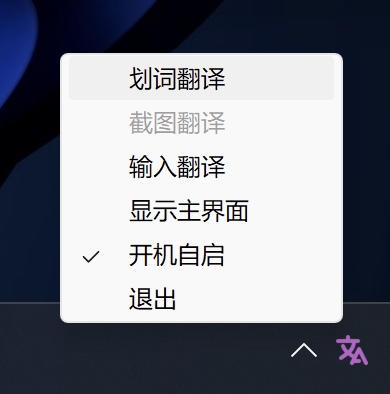

<h1 align="center">STranslate</h1>

WPF 开发的一款<strong>即开即用</strong>、<strong>即用即走</strong>的翻译工具

## 功能

- [x] 添加 DeepL API
- [x] 实现基本翻译功能
- [x] 优化防止多开
- [x] 添加划词翻译
- [x] 添加复制结果蛇形、大小驼峰
- [x] 软件层面识别语种（目前支持中英文）
- [x] 添加开机自启
- [x] 添加亮/暗主题
- [ ] 添加 OCR 翻译
- [ ] 添加翻译记录缓存功能

## 使用

打开软件后会静默在后台，等待调用
1. 全局监听快捷键
- `Alt` + `A` 打开软件界面，输入内容按回车翻译
- `Alt` + `D` 复制当前鼠标选中内容并翻译
- `Alt` + `G` 打开窗口(不清空内容)

2. 软件内快捷键
- `ESC` 隐藏界面
- `Ctrl+Shift+Q` 退出程序
- `Ctrl+Shift+T` 置顶/取消置顶

点击软件外部界面任意处或点击软件则会自动隐藏到后台，即用即走。

3. 0.08 版本添加开机启动

## 接口失效

若远端接口均失效，需要自己本地运行翻译服务(感谢[zu1k](https://github.com/zu1k))，根据自己的系统 [下载](https://github.com/zu1k/removed-2022-07-12) 自己的版本，软件右上角选择 `local` 接口即可

## 参考项目

[https://github.com/NPCDW/WpfTool](https://github.com/NPCDW/WpfTool)  

[https://github.com/zu1k/removed-2022-07-12/releases/tag/0.1.2](https://github.com/zu1k/removed-2022-07-12/releases/tag/0.1.2)