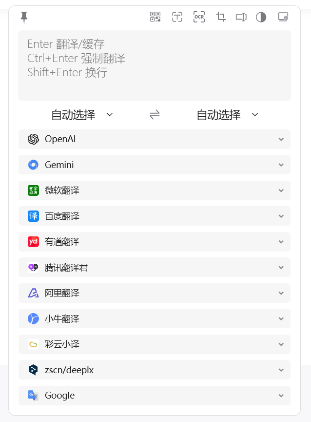
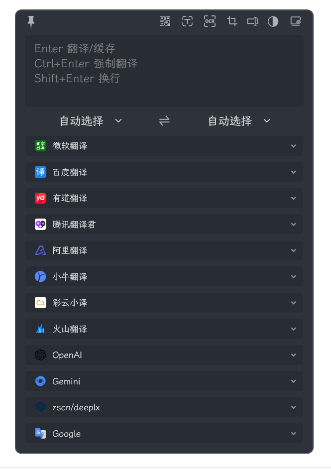
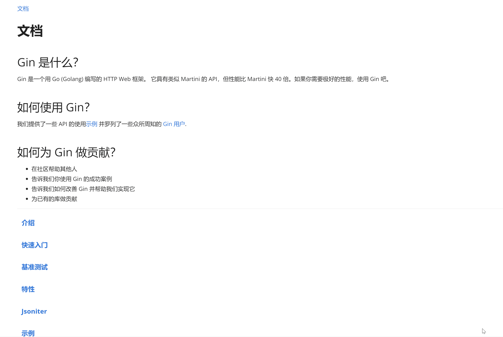
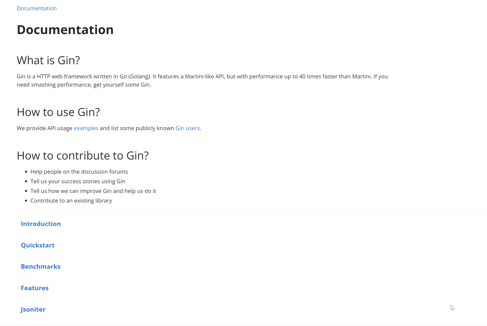
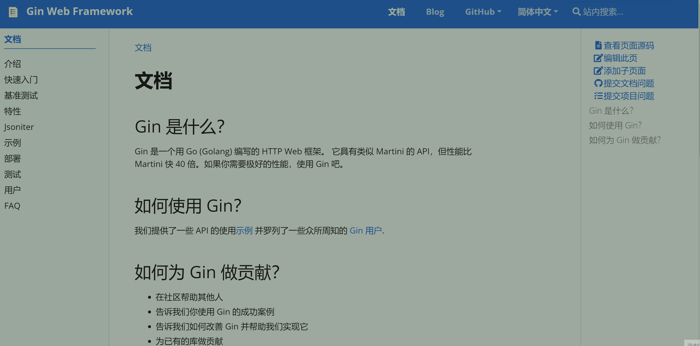

<p align="center">
<a href="https://github.com/zggsong/STranslate" target="_blank">

</a>
</p>
<p align="center">
<a href="https://github.com/ZGGSONG/STranslate/blob/main/LICENSE" target="_self">
 
</a>
<a href="https://github.com/ZGGSONG/STranslate/releases/latest" target="_blank">
 
</a>
<a href="https://hub.docker.com/r/zggsong/translate">
  
</a>
<a href="https://github.com/ZGGSONG/STranslate" target="_self">
 
</a>
</p>
<h1 align="center">STranslate</h1>

<p align="center">WPF 开发的一款<strong>即开即用</strong>、<strong>即用即走</strong>的翻译、OCR工具
</p>

## 访问

| 国外 | 国内 |
| :--: | :--: |
| **[Github](https://github.com/ZGGSONG/STranslate)** | **[Gitee](https://gitee.com/zggsong/STranslate)** |


## 安装

下载最新 [Release](https://github.com/ZGGSONG/STranslate/releases) 版本后解压即可使用

## 使用

打开软件后会静默在后台，等待调用，点击软件外部任意处即自动隐藏到后台——即用即走。

| 明亮 | 黑暗 |
| :--: | :--: |
|  |  |

1. 全局快捷键

> 可自行修改

| 快捷键 | 功能 | 演示 |
| :-- | :-- | :-- |
| `Alt` + `A` | 打开软件界面，输入内容按`回车`翻译 |  |
| `Alt` + `D` | 复制当前鼠标选中内容并翻译 |  |
| `Alt` + `S` | 截图选中区域内容并翻译 |  |
| `Alt` + `G` | 打开主界面 |  |
| `Alt` + `Shift` + `A` | 打开监听剪贴板，复制文字后立即翻译 | 暂无 |
| `Alt` + `Shift` + `D` | 打开监听鼠标划词，鼠标滑动选中文字立即翻译 |  |
| `Alt` + `Shift` + `S` | 完全离线文字识别(基于PaddleOCR) |  |
| `Alt` + `Shift` + `F` | 静默OCR(OCR后自动复制到剪贴板) |  |


2. 软件内快捷键

> 不可修改

- `ESC` 隐藏界面(含取消请求)
- `Ctrl` + `,` 打开设置
- `Ctrl` + `Shift` + `A` 隐藏/显示输入框
- `Ctrl` + `Shift` + `Q` 退出程序
- `Ctrl` + `Shift` + `T` 置顶/取消置顶
- `Ctrl` + `滚轮上` 放大文字
- `Ctrl` + `滚轮下` 缩小文字
- `Ctrl` + **`** 恢复默认文字大小
- `Ctrl` + `+` 放大界面(宽度、最大高度)
- `Ctrl` + `-` 缩小界面(宽度、最大高度)
- `Ctrl` + `0` 界面恢复配置大小(宽度、最大高度)
- `Ctrl` + `Alt` + `+` 宽度增加
- `Ctrl` + `Alt` + `-` 宽度减少
- `Ctrl` + `Shift` + `+` 最大高度增加
- `Ctrl` + `Shift` + `-` 最大高度减少
- `Ctrl` + `1...8` 按顺序复制翻译服务结果
- `Ctrl` + `9` 复制最后一个翻译服务结果

3. 软件集成缓存功能，默认翻译一次则会缓存住，再次翻译或默认查询缓存，如果缓存存在则返回缓存结果，如需强制翻译只需要输入内容后按 `Ctrl` + `Enter` 即可

4. 添加服务


5. 软件集成二维码识别，触发方式为: `右键任务栏图标`-`二维码`

| 方式一 | 方式二 | 方式三 |
| :--: | :--: | :--: |
|| |  |

5. 历史记录


6. 更新热键


7. 升级功能

> 文件在github上，需要挂代理，否则很慢！！！  
> 此外，升级方式所下载的为不带有`Runtime`的版本，如需带有`Runtime`版本，前往 [Release](https://github.com/ZGGSONG/STranslate/releases) 页面下载带有 `self contained` 标记的软件压缩包


## 加密

1.0.3.118 版本以后开始加密保存密钥等信息到本地，如需查看请进入软件`偏好设置`-`服务`中显示查看密钥等信息


## 服务

### !!!本地服务!!!

**★★★ `1.0.6.201` 推出本地服务接口，即开即用，避免多人使用公共接口导致失效问题★★★**
> 服务页面中添加`STranslate`的服务即可

### 免费接口
当请求人数较多时，远端接口可能暂时失效，可自行运行翻译接口程序
1. 下载对应平台可 [执行文件](https://github.com/ZGGSONG/STranslate/releases/tag/0.01)
2. 下载作者打包的 [Docker镜像](https://hub.docker.com/r/zggsong/translate)
3. 开源项目 [https://github.com/OwO-Network/DeepLX](https://github.com/OwO-Network/DeepLX)

> 针对上述方式仅需在软件`偏好设置`-`服务`- 添加`自建服务`后修改接口地址为对应接口地址即可

### 付费接口

> 国内可访问的公共 `Gemini API`: `https://gemini.vercel.zggsong.com`

1. [百度翻译](https://fanyi-api.baidu.com)
2. [微软翻译](https://azure.microsoft.com/zh-cn/products/ai-services/ai-translator)
3. [OpenAI](https://openai.com)
4. [Google Gemini](https://makersuite.google.com/app/apikey)
5. [腾讯翻译君](https://cloud.tencent.com/product/tmt)
6. [有道翻译](https://ai.youdao.com/)
7. [阿里翻译](https://www.aliyun.com/product/ai/base_alimt)
8. [小牛翻译](https://niutrans.com/trans?type=text)
9. [彩云小译](https://dashboard.caiyunapp.com/user/sign_in/)
10. [火山引擎](https://www.volcengine.com/)
11. [简明英汉词典](https://github.com/skywind3000/ECDICT)
12. [智谱AI](https://open.bigmodel.cn/)

> 简明英汉词典在Github上，下载慢的可以手动点击下载离线资源包([官方-离线资源包](https://github.com/skywind3000/ECDICT/releases/download/1.0.28/ecdict-sqlite-28.zip)、[国内-离线资源包](https://www.123pan.com/s/AxlRjv-u5VmA.html))，放在软件根目录后再次点击下载后即可立即使用

## TTS

1. [离线TTS](https://learn.microsoft.com/zh-cn/dotnet/api/system.speech.synthesis.speechsynthesizer?view=dotnet-plat-ext-8.0)
2. [Azure TTS](https://azure.microsoft.com/zh-cn/products/ai-services/text-to-speech)


## 疑问

1. 问：划词翻译无法获取? 答：建议开启管理员权限启动，`设置`-`常规设置`-`以管理员权限启动`-`重启软件`
2. 问：公共接口挂了怎么办？答：用的人越来越多，公共接口在官方认为是一个ip疯狂请求，会被限制请求，最好的是自己建一个，下面免费接口里面任选一种方式，在软件中修改或添加你的本地接口(如: `http://127.0.0.1:8080/translate`，具体ip、端口以实际为准) 注: [1.0.6.201](https://github.com/ZGGSONG/STranslate/releases/tag/1.0.6.201) 开始有本地服务，直接开启后可替代自建免费服务
3. 问：有没有别的官方接口？答：提`Feature Issue`，有空的话我会优先适配
4. 问：存在BUG？提[Issue](https://github.com/ZGGSONG/STranslate/issues)，最好带上所运行`软件版本`、`系统版本`、`复现条件`，有条件可以带上`视频`或`GIF`
5. 问：软件设置不生效？答：软件设置页面基本需要修改完配置，点击保存后生效，部分配置修改完立即生效的也在配置说明处标注了 `[立即生效]`

## 卸载

1. 打开 cmd 运行下面的命令即可
> 或者双击运行目录下的`ClearCache.bat`文件
```shell
rd /s /q "%localappdata%\stranslate"
```
2. 删除软件运行目录


## 开发历史

<details>
<summary>详细内容</summary>

- 2024-03-07 1.0.8.313 优化使用体验、添加智谱AI、添加自定义Prompt、添加Prompts管理、添加监听剪贴板功能、新增单个服务翻译失败后重试...

- 2024-03-04 1.0.7.304 优化使用体验，添加TTS，添加简明英汉词典等...

- 2024-02-01 1.0.6.201 添加火山引擎、本地服务

- 2024-01-31 1.0.5.131 添加支持腾讯、阿里、有道、小牛、彩云等API，添加搜索历史记录，优化软件使用体验

- 2024-01-18 1.0.3.118 添加OpenAI、Gemini接口，静默OCR等功能，修复了若干BUG和优化体验...

- 2024-01-14 1.0.2.114 添加必应官方接口、禁用系统代理等功能...

- 2024-01-11 1.0.1.111 添加动态监听系统代理功能...

- 2024-01-04 1.0.0.104 全新开发（新更新程序变动较大，`1.*`开始需要全新安装一次）

- 2023-03-02 0.25 添加复制提醒动画

- 2023-02-28 0.24 添加 deepl 接口(已经安装的cmd运行 `del %localappdata%\stranslate\stranslate.json` 后打开即可更新接口)

- 2023-02-24 0.22 优化分辨率切换时托盘图标模糊问题

- 2023-01-17 0.20 添加翻译记录缓存功能，重复翻译从本地数据库获取，本地记录数量上限可调整

- 2023-01-12 0.18 优化 GC 后台静默运行内存占用保持 4MB 左右

- 2023-01-12 0.17 添加检查更新功能

- 2023-01-10 0.15 添加离线 OCR 功能，其使用 [tesseract](https://github.com/tesseract-ocr/tesseract) 目前仅支持英文

- 2023-12-28 0.10 添加明暗主题切换功能

- 2022-12-27 0.08 版本添加开机启动

</details>


## 感谢

- 特别鸣谢 [zu1k](https://github.com/zu1k)
- 感谢 [Bob](https://bobtranslate.com/guide/) 的启发
- 感谢 [PaddleOCRSharp](https://gitee.com/raoyutian/paddle-ocrsharp) 对paddleocr的封装
- 感谢 [WpfTool](https://github.com/NPCDW/WpfTool) 截图功能
- 感谢 [Tai](https://github.com/Planshit/Tai) 升级功能
- 感谢 ChatGPT
- 感谢 JetBrains 提供开源项目免费License

<a href="https://jb.gg/OpenSourceSupport"></a>

## 打赏

觉得不错的话可以请作者喝杯阔落

| 微信 | 支付宝 |
| :--: | :--: |
| |  |

## 作者

**STranslate** © [zggsong](https://github.com/zggsong), Released under the [MIT](https://github.com/ZGGSONG/STranslate/blob/main/LICENSE) License.<br>

> Website [Blog](https://www.zggsong.com) · GitHub [@zggsong](https://github.com/zggsong)

## Star History

[](https://star-history.com/#ZGGSONG/STranslate&Date)
