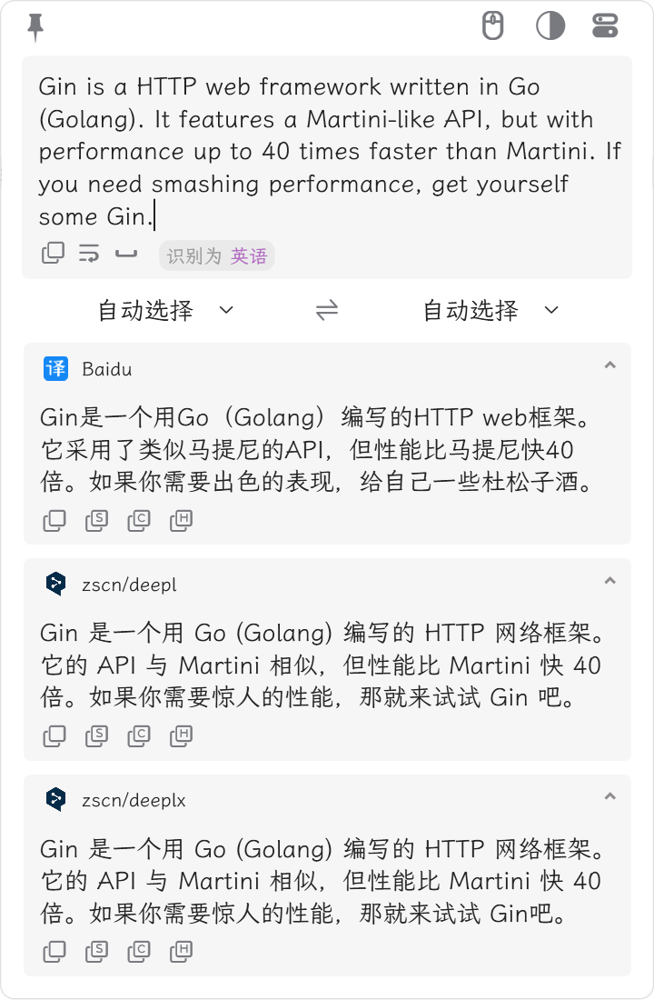
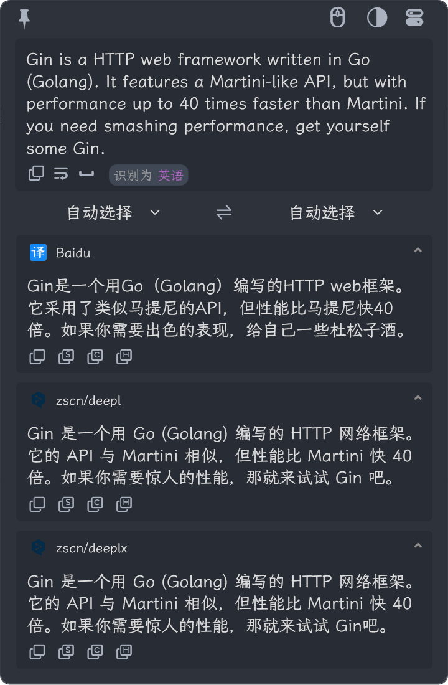

<p align="center">
<a href="https://github.com/zggsong/STranslate" target="_blank">

</a>
</p>
<p align="center">
<a href="https://github.com/ZGGSONG/STranslate/blob/main/LICENSE" target="_self">
 
</a>
<a href="https://github.com/ZGGSONG/STranslate/releases/latest" target="_blank">
 
</a>
<a href="https://hub.docker.com/r/zggsong/translate">
  
</a>
<a href="https://github.com/ZGGSONG/STranslate" target="_self">
 
</a>
</p>
<h1 align="center">STranslate</h1>

<p align="center">WPF 开发的一款<strong>即开即用</strong>、<strong>即用即走</strong>的翻译工具
</p>

## 安装

下载最新 [Release](https://github.com/ZGGSONG/STranslate/releases) 版本后解压即可使用

## 使用

| 亮色 | 暗色 |
| :-- | :-- |
|  |  |

打开软件后会静默在后台，等待调用

1. 全局监听快捷键
- `Alt` + `A` 打开软件界面，输入内容按回车翻译
- `Alt` + `D` 复制当前鼠标选中内容并翻译
- `Alt` + `S` 截图选中区域内容并翻译
- `Alt` + `G` 打开主界面
- `Alt` + `Shift` + `S` 完全离线文字识别(基于PaddleOCR)
- `Alt` + `Shift` + `D` 打开监听鼠标划词，鼠标滑动选中文字立即翻译

1. 软件内快捷键
- `ESC` 隐藏界面
- `Ctrl+Shift+Q` 退出程序
- `Ctrl+Shift+R` 切换主题
- `Ctrl+Shift+T` 置顶/取消置顶

点击软件外部任意处即自动隐藏到后台——即用即走。

## 卸载

1. 打开 cmd 运行下面的命令即可
> 或者双击运行目录下的`ClearCache.bat`文件
```shell
rd /s /q "%localappdata%\stranslate"
```
2. 删除软件运行目录


## 开发历史

- 2024-01-04 1.0.0.104 全新开发（新更新程序变动较大，`1.*`开始需要全新安装一次）

- 2023-03-02 0.25 添加复制提醒动画

- 2023-02-28 0.24 添加 deepl 接口(已经安装的cmd运行 `del %localappdata%\stranslate\stranslate.json` 后打开即可更新接口)

- 2023-02-24 0.22 优化分辨率切换时托盘图标模糊问题

- 2023-01-17 0.20 添加翻译记录缓存功能，重复翻译从本地数据库获取，本地记录数量上限可调整

- 2023-01-12 0.18 优化 GC 后台静默运行内存占用保持 4MB 左右

- 2023-01-12 0.17 添加检查更新功能

- 2023-01-10 0.15 添加离线 OCR 功能，其使用 [tesseract](https://github.com/tesseract-ocr/tesseract) 目前仅支持英文

- 2023-12-28 0.10 添加明暗主题切换功能

- 2022-12-27 0.08 版本添加开机启动

## 免费接口

当请求人数较多时，远端接口可能暂时失效，可自行运行翻译接口程序
1. 下载对应平台可 [执行文件](https://github.com/ZGGSONG/STranslate/releases/tag/0.01)，随后在软件右上角选择 `local` 接口即可
2. 下载 [docker镜像](https://hub.docker.com/r/zggsong/translate)，关闭软件 - cmd 运行 `start %localappdata%\stranslate\stranslate.json` - 修改接口地址 - 重启软件即可
3. [https://github.com/OwO-Network/DeepLX](https://github.com/OwO-Network/DeepLX)

## 付费接口

1. 支持[百度翻译API](https://fanyi-api.baidu.com/product/11)

## Author 作者

**STranslate** © [zggsong](https://github.com/zggsong), Released under the [MIT](https://github.com/ZGGSONG/STranslate/blob/main/LICENSE) License.<br>
Authored and maintained by zggsong with help from other open source projects [WpfTool](https://github.com/NPCDW/WpfTool) and [Tai](https://github.com/Planshit/Tai).

> Website [Blog](https://www.zggsong.com) · GitHub [@zggsong](https://github.com/zggsong)
