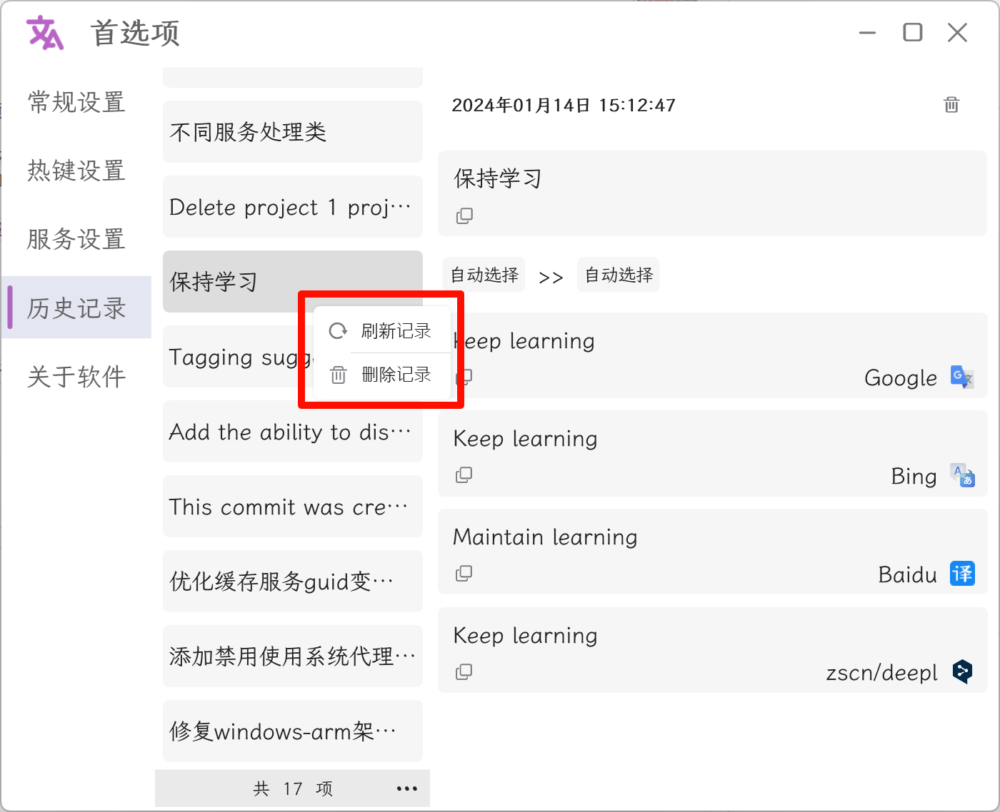
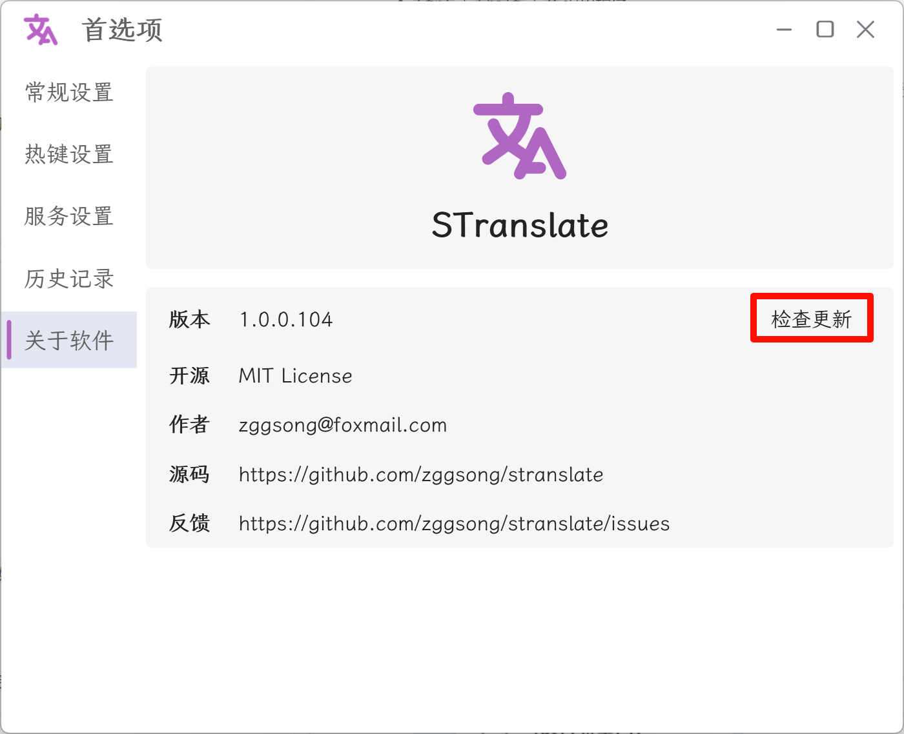
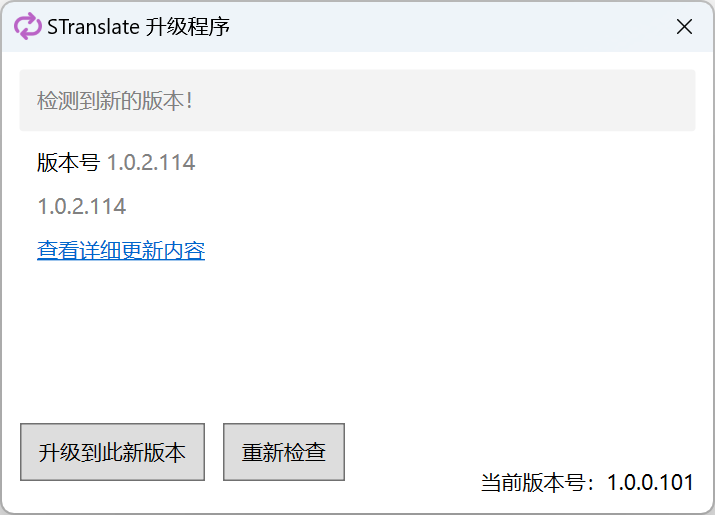
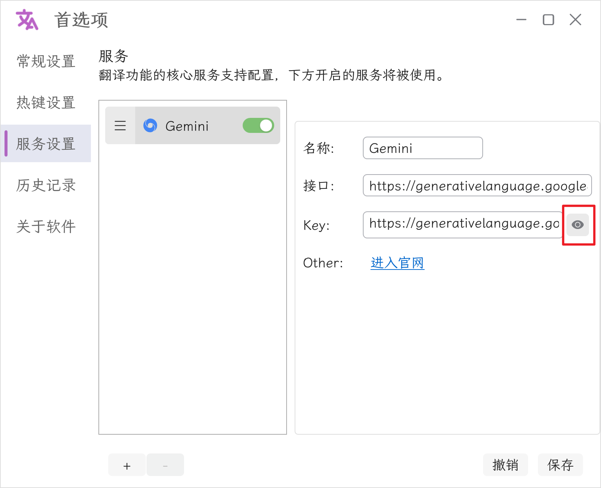

<p align="center">
<a href="https://github.com/zggsong/STranslate" target="_blank">

</a>
</p>
<p align="center">
<a href="https://github.com/ZGGSONG/STranslate/blob/main/LICENSE" target="_self">
 
</a>
<a href="https://github.com/ZGGSONG/STranslate/releases/latest" target="_blank">
 
</a>
<a href="https://hub.docker.com/r/zggsong/translate">
  
</a>
<a href="https://github.com/ZGGSONG/STranslate" target="_self">
 
</a>
</p>
<h1 align="center">STranslate</h1>

<p align="center">WPF 开发的一款<strong>即开即用</strong>、<strong>即用即走</strong>的翻译工具
</p>

## 安装

下载最新 [Release](https://github.com/ZGGSONG/STranslate/releases) 版本后解压即可使用

## 使用

打开软件后会静默在后台，等待调用，点击软件外部任意处即自动隐藏到后台——即用即走。

1. 全局快捷键

| 快捷键 | 功能 | 演示 |
| :-- | :-- | :-- |
| `Alt` + `A` | 打开软件界面，输入内容按`回车`翻译 |  |
| `Alt` + `D` | 复制当前鼠标选中内容并翻译 |  |
| `Alt` + `S` | 截图选中区域内容并翻译 |  |
| `Alt` + `G` | 打开主界面 |  |
| `Alt` + `Shift` + `D` | 打开监听鼠标划词，鼠标滑动选中文字立即翻译 |  |
| `Alt` + `Shift` + `S` | 完全离线文字识别(基于PaddleOCR) |  |
| `Alt` + `Shift` + `F` | 静默OCR(OCR后自动复制到剪贴板) |  |


2. 软件内快捷键
- `ESC` 隐藏界面(含取消请求)
- `Ctrl` + `,` 打开设置
- `Ctrl` + `Shift` + `Q` 退出程序
- `Ctrl` + `Shift` + `R` 切换主题
- `Ctrl` + `Shift` + `T` 置顶/取消置顶

3. 软件集成缓存功能，默认翻译一次则会缓存住，再次翻译或默认查询缓存，如果缓存存在则返回缓存结果，如需强制翻译只需要输入内容后按 `Ctrl` + `Enter` 即可

4. 软件集成二维码识别，触发方式为: `右键任务栏图标`-`二维码`

| 方式一 | 方式二 |
| :-- | :-- |
||

5. 历史记录

> 刷新方式: 记录列`右键`-`刷新纪录`即可



6. 更新热键


7. 后续升级仅需点击软件`偏好设置`-`关于`-`检查更新`即可



> 文件在github上，需要挂代理，否则很慢！！！



## 注意

1.0.3.118 版本以后开始加密保存密钥等信息，如需查看请进入软件`偏好设置`-`服务`中显示查看密钥等信息



## 疑问

1. 问：划词翻译无法获取? 答：建议开启管理员权限启动，`设置`-`常规设置`-`以管理员权限启动`-`重启软件`
2. 问：历史记录无法更新？答：`列表右键`-`手动刷新`
3. 问：公共接口挂了怎么办？答：用的人越来越多，公共接口在官方认为是一个ip疯狂请求，会被限制请求，最好的是自己建一个，下面免费接口里面任选一种方式，在软件中修改或添加你的本地接口(如: `http://127.0.0.1:8080/translate`，具体ip、端口以实际为准)
4. 问：有没有别的官方接口？答：提`Feature Issue`，有空的话我会优先适配

## 卸载

1. 打开 cmd 运行下面的命令即可
> 或者双击运行目录下的`ClearCache.bat`文件
```shell
rd /s /q "%localappdata%\stranslate"
```
2. 删除软件运行目录


## 开发历史

<details>
<summary>详细内容</summary>

- 2024-01-18 1.0.3.118 添加OpenAI、Gemini接口，静默OCR等功能，修复了若干BUG和优化体验...

- 2024-01-14 1.0.2.114 添加必应官方接口、禁用系统代理等功能...

- 2024-01-11 1.0.1.111 添加动态监听系统代理功能...

- 2024-01-04 1.0.0.104 全新开发（新更新程序变动较大，`1.*`开始需要全新安装一次）

- 2023-03-02 0.25 添加复制提醒动画

- 2023-02-28 0.24 添加 deepl 接口(已经安装的cmd运行 `del %localappdata%\stranslate\stranslate.json` 后打开即可更新接口)

- 2023-02-24 0.22 优化分辨率切换时托盘图标模糊问题

- 2023-01-17 0.20 添加翻译记录缓存功能，重复翻译从本地数据库获取，本地记录数量上限可调整

- 2023-01-12 0.18 优化 GC 后台静默运行内存占用保持 4MB 左右

- 2023-01-12 0.17 添加检查更新功能

- 2023-01-10 0.15 添加离线 OCR 功能，其使用 [tesseract](https://github.com/tesseract-ocr/tesseract) 目前仅支持英文

- 2023-12-28 0.10 添加明暗主题切换功能

- 2022-12-27 0.08 版本添加开机启动

</details>

## 免费接口

当请求人数较多时，远端接口可能暂时失效，可自行运行翻译接口程序
1. 下载对应平台可 [执行文件](https://github.com/ZGGSONG/STranslate/releases/tag/0.01)
2. 下载作者打包的 [Docker镜像](https://hub.docker.com/r/zggsong/translate)
3. 开源项目 [https://github.com/OwO-Network/DeepLX](https://github.com/OwO-Network/DeepLX)

> 针对上述方式仅需在软件`偏好设置`-`服务`-`添加DeepL服务`后修改接口地址为对应接口地址即可

## 付费接口

1. 支持 [百度翻译](https://fanyi-api.baidu.com)
2. 支持 [必应翻译](https://azure.microsoft.com/zh-cn/products/ai-services/ai-translator)
3. 支持 [OpenAI](https://openai.com)
4. 支持 [Google Gemini](https://makersuite.google.com/app/apikey)


## 感谢

- [PaddleOCRSharp](https://gitee.com/raoyutian/paddle-ocrsharp)
- [WpfTool](https://github.com/NPCDW/WpfTool)
- [Tai](https://github.com/Planshit/Tai)

- 感谢 JetBrains 提供开源项目免费License 

<a href="https://jb.gg/OpenSourceSupport"></a>

## 作者

**STranslate** © [zggsong](https://github.com/zggsong), Released under the [MIT](https://github.com/ZGGSONG/STranslate/blob/main/LICENSE) License.<br>

> Website [Blog](https://www.zggsong.com) · GitHub [@zggsong](https://github.com/zggsong)

## Star History

[](https://star-history.com/#ZGGSONG/STranslate&Date)
